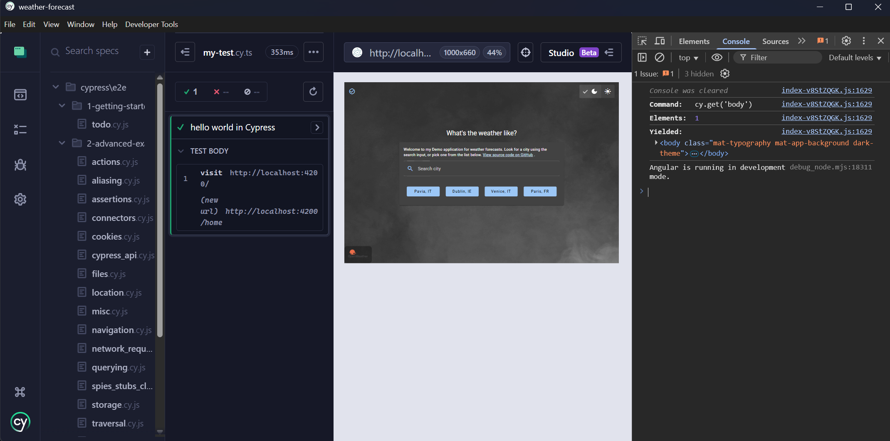

# Cypress Guide

## Overview

This short guide explains how to install, configure, and write Cypress tests for this project (TypeScript + Cypress).

---

## Install

Install Cypress as a dev dependency:

```bash
npm install cypress -D
```

---

## Add npm scripts

Add this script to `package.json` to open the interactive Test Runner:

```json
"scripts": {
  "e2e": "npx cypress open"
}
```

Run tests from the terminal:

- Interactive Test Runner: `npm run e2e` (runs `npx cypress open`)
- Headless (CI): `npx cypress run`

Note: the Test Runner can use Electron by default; when Electron is selected the tests run inside the embedded Electron browser instead of an external browser.

e' importante che prima di runnare qualunque test e2e, l'applicazione sia già avviata.

---

## Project structure (recommended)

Organize tests under the `cypress` folder:

```
cypress/
  e2e/
    my-test/
      my-test.cy.ts
      my-second-test.cy.ts
  fixtures/
  support/
```

Create your test files with the `.cy.ts` extension (Cypress v10+ uses **cypress/e2e** by default).

---

## Example test

Create **cypress/e2e/my-test/my-test.cy.ts** with this minimal example:

```ts
it("lands on homepage", () => {
	cy.visit("http://127.0.0.1:4200/");
});
```

Use `describe()` to group tests and `it()` for individual test cases.

---

## OLD: TypeScript configuration for Cypress

To get proper Intellisense and Cypress types in your `.ts` test files, add a **tsconfig.json** inside the `cypress/` folder with the following content:

```json
{
	"compilerOptions": {
		"target": "es5",
		"lib": ["es5", "dom"],
		"types": ["cypress", "node"]
	},
	"include": ["**/*.ts"]
}
```

This enables type definitions and editor autocompletion for Cypress commands.

---

## Writing assertions

Cypress uses Mocha-style test functions and Chai assertions:

- `describe()` and `it()` to structure tests
- `cy.*` commands to interact with the app (e.g., `cy.visit`, `cy.get`, `cy.click`)
- `expect()` / `should()` for assertions (Chai is available)

Example assertion:

```ts
cy.get(".title").should("contain.text", "Weather");
expect(1 + 1).to.equal(2);
```

## cypress methods

- visit(): visita il sito web
- contains(): controlla se la pagina contiene un determinato testo

Da notare che cypress aspetta 4 secondi prima di decretare che l'assertion è falsa, questo per evitare che tempi fisiologici di caricamento impediscano la verifica del test.

---

## Useful tips

- Start the dev server before running tests (e.g., `npm start` or `ng serve`).
- Set `baseUrl` in **cypress.config.ts** to simplify `cy.visit()` calls.
- Use `cy.intercept()` to stub network requests during tests.
- Run headless tests in CI with `npx cypress run`.

---

## Troubleshooting

- If you see missing types in editor, make sure **cypress/tsconfig.json** exists and includes `types: ["cypress"]`.
- Se possiedi un file tsconfig.spec.ts per gli unit test con jasmine, si potrebbe avere un conflitto tra i type cypress e i type jasmine; questo causa i metodi di jasmine di venire sovrascritti da quelli cypress o non essere riconosciuti; per evitare questo problema, una possibile soluzione è aggiungere `"exclude": ["src/**/*.spec.ts"]` al **tsconfig.json** principale e aggiungere `"include": ["src/**/*.spec.ts"]` al **tsconfig.spec.json**.
- If tests behave differently in Electron than your browser, try selecting a real browser in the Test Runner or run headless in the desired browser.

## Debug

per eseguire un test, è sufficiente selezionarlo dall'albero a sinistra. Per visualizzare tutti i log, è possibile selezionare dal menu in alto "Developer Tools" (per Chrome sarà F12, per Electron Ctrl+Shift+i)


